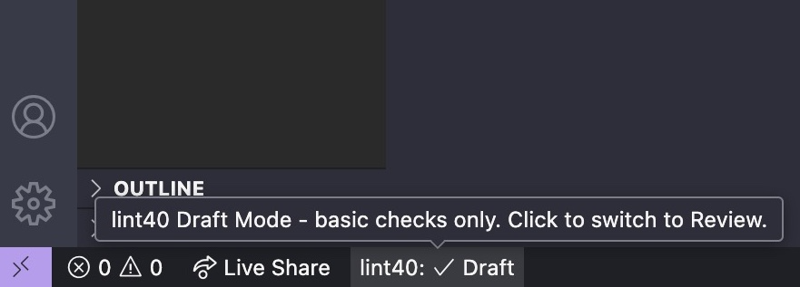
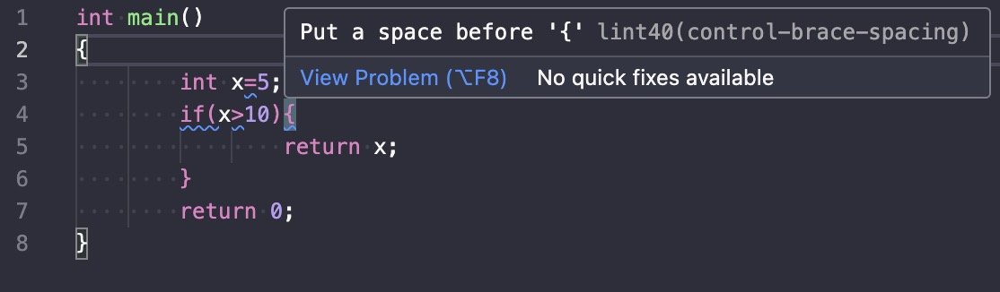
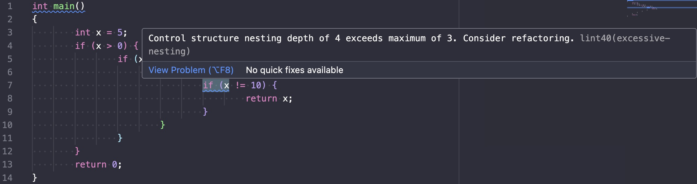
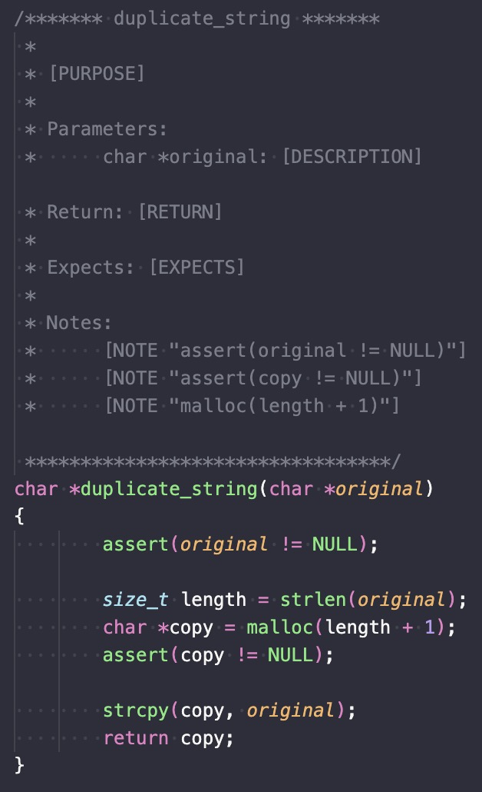

# lint40 README

A C linter enforcing course coding standards with contract generation and dual-mode checking

## Features

**Two Modes**: Draft mode (basic checks) and Review mode (submission-ready validation) 
**Style Enforcement**: Curly braces spacing, 8-space indentation, operator spacing 
**Contract Generation**: Auto-generate function and file headers with templates that include all necessary components and notes (for unexpected exits, memory allocation, etc) 
**Code Quality Checks**: Prevent poor practices like global variables, excessive nesting, and style violations

## Usage

1. Install the extension
2. Open any `.c` file
3. Click the status bar to toggle between Draft/Review modes
4. Use `Ctrl+Shift+P` → "Generate Function Contract", "Generate File Header", or "Generate Struct Documentation" for templates

  

<em>Status Bar Integration</em>

 

<em>Linting Example in Draft Mode</em>

 

<em>Linting Example in Review Mode</em>

 

<em>Documentation Template Example</em>

## Requirements

- VS Code 1.101.0 or higher
- C files (.c extension)

### 0.0.3
Description Fixes
